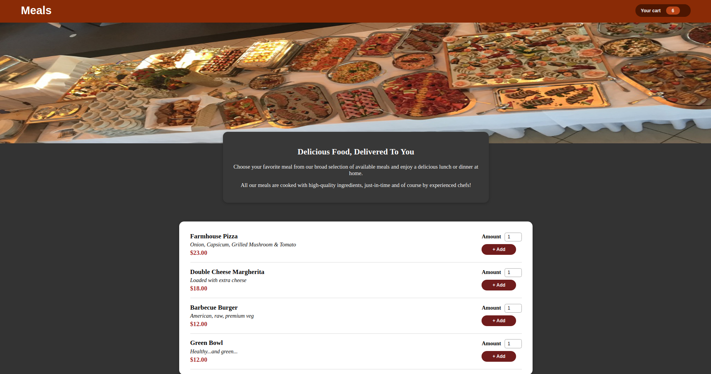
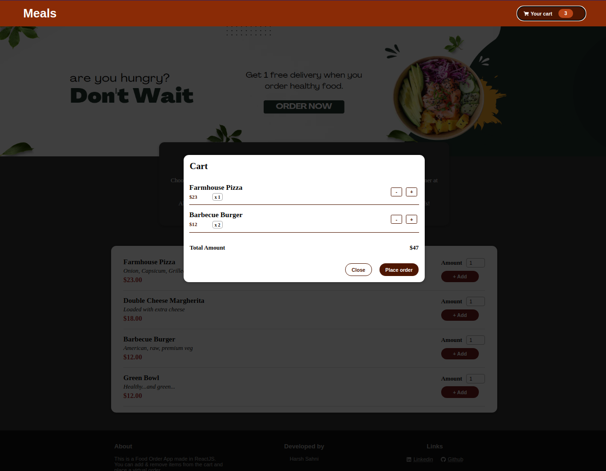

# About
This is a demo food order app made in ReactJS. You can add food items in your cart, view contents on the cart, place virtual order and get the bill for the same.

Core ReactJS concepts used in this app:

- React Context API
- useState Hook
- useRef Hook
- useContext Hook
- useReducer Hook
- React Fragment
- React Portal
- props
- react-icons

# Screenshots

### Homepage

### Cart

