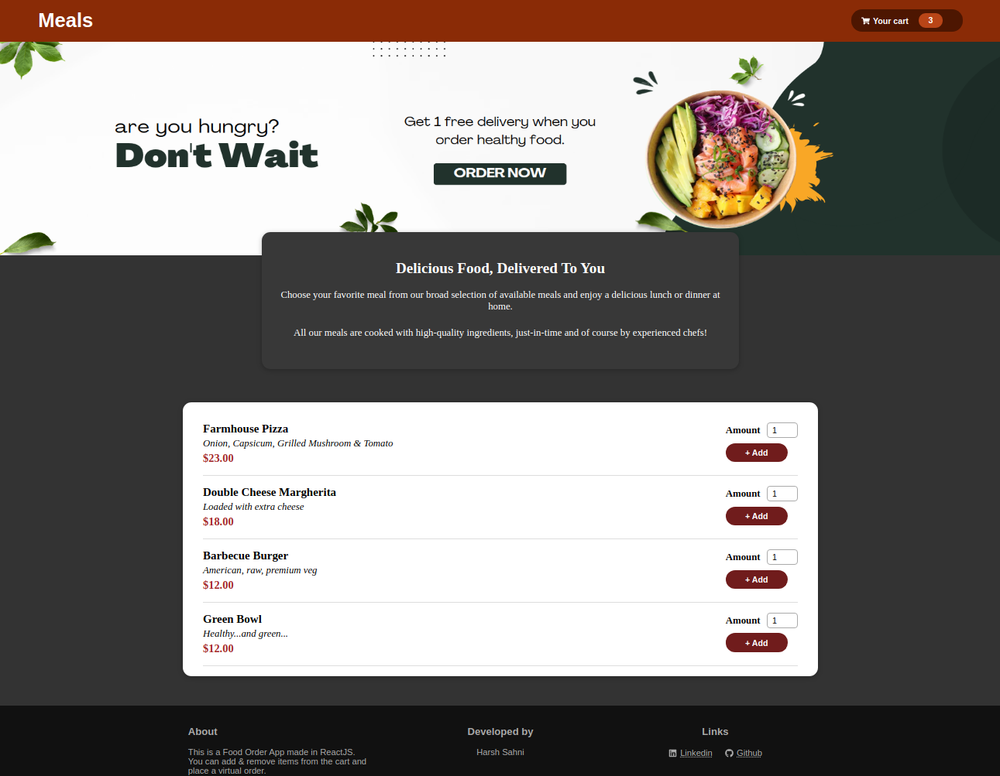
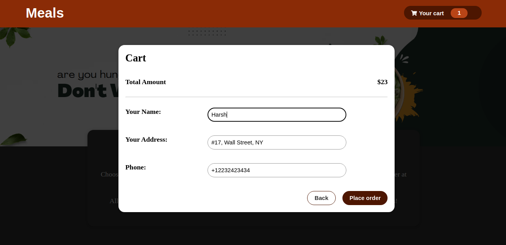

# (A) About

This is a demo food order app made in ReactJS. You can add food items in your cart, view contents on the cart, place virtual order and get the bill for the same.

Check it out <a href="https://harsh-sahni-projects.github.io/food-order-app/" target="_blank">live here.</a>

Core ReactJS concepts used in this app:

- React Context API
- useState Hook
- useRef Hook
- useContext Hook
- useReducer Hook,
- useMemo Hook
- React Fragment
- React Portal
- props
- react-icons
- fetch API
- Firebase database

# (B) Screenshots

### (i) Homepage

### (ii) Cart

### (iii) Checkout

# (C) Features

1. Meal items are fetched from firebase database automatically when you land on homepage
2. You can add items in your cart
3. View cart items in a modal box
4. Place your order. Order details will be stored in firebase db
